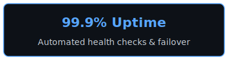
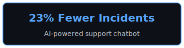

<div align="center">

<a href="https://ashwinberyl.github.io">

</a>

**Platform Engineer · DevSecOps · 8 Years**

*I can write apps. I choose to build the ground they stand on.*

[](https://ashwinberyl.github.io)
&nbsp;&nbsp;
[](mailto:ashwinberyl@gmail.com)
&nbsp;&nbsp;
[](https://ashwinberyl.github.io/blogs/)

</div>


###  &nbsp;About Me

```yaml
location: Bengaluru, India
role: Platform Engineer — DevSecOps @ Aptiv
focus: Cloud Infrastructure, CI/CD, Security, Developer Experience
education: B.E. Mechanical — Anna University, 2017

philosophy: >
  The best platform engineering is invisible. Developers shouldn't
  need to think about infra — they should just ship.
```


###  &nbsp;Impact

<div align="center">
  &nbsp;
  <br>
  &nbsp;
  <br>
  &nbsp;
  <br>
  &nbsp;
</div>


###  &nbsp;Tech Stack

<div align="center">
<br>

<a href="#"></a>
&nbsp;
<a href="#"></a>
&nbsp;
<a href="#"></a>
&nbsp;
<a href="#"></a>
&nbsp;
<a href="#"></a>

<br><br>


<br><br>

</div>


<div align="center">


<br>

<sub>📍 Bengaluru </sub>

<br>


</div>
